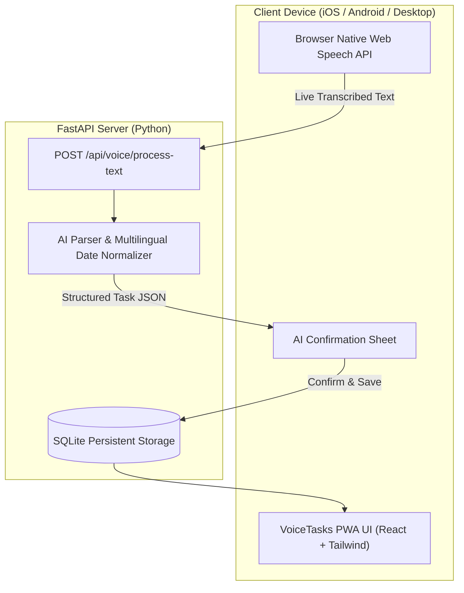

# 🎙️ VoiceTasks AI

> **A voice-first, multilingual AI task manager built as an installable Progressive Web App (PWA) with a Python FastAPI backend.**

Speak naturally in **any language** (English, Hindi, Punjabi, Hinglish, Spanish, etc.), and the AI pipeline will transcribe, understand dates & times (*"kal shaam 6 baje"*, *"tomorrow at 10 AM"*, *"ਕੱਲ੍ਹ ਸ਼ਾਮ gym ਜਾਣਾ"*), and automatically create structured, prioritized tasks.

---

## 🌟 Key Features

* **📱 Universal Installable PWA:**
  * **Android:** Native "Install App" browser prompt via Web App Manifest & Service Worker.
  * **iOS (iPhone/iPad):** Zero-friction "Add to Home Screen" support (no App Store fees or Mac required).
* **🎙️ Voice Capture in Any Language:**
  * Real-time browser-native Web Speech API with soundwave visualizer & live transcription.
  * Zero latency, zero cloud upload fees, and works natively across Chrome, Safari, and Edge.
* **🧠 Context-Aware AI Task Extraction:**
  * Automatically resolves relative dates (*"kal"*, *"parson"*, *"today"*, *"next Monday"*) based on user timezone.
  * Resolves colloquial times (*"subah"* $\rightarrow$ 09:00, *"shaam"* $\rightarrow$ 18:00, *"raat"* $\rightarrow$ 21:00).
  * Auto-tags category (*study, work, health, finance, personal*) and priority (*low, medium, high*).
* **✅ Pre-Save AI Confirmation Sheet:**
  * Clean review modal allowing users to edit the parsed title, pick dates, or adjust categories before saving.
  * Celebratory confetti animation upon task creation.
* **⚡ Offline-Resilient & Fast:**
  * SQLite persistent database on FastAPI backend.
  * Automatic `localStorage` caching in the PWA so tasks are always accessible even when offline.

---

## 🏗️ Architecture



---

## 🚀 Quick Start (Running Locally)

### 1. Prerequisites
* **Node.js** (v18+)
* **Python** (3.11+)

---

### 2. Backend Setup (FastAPI)

```bash
# Navigate to backend
cd backend

# Create virtual environment (if not already created)
python -m venv venv

# Activate virtual environment
# Windows (PowerShell):
.\venv\Scripts\Activate.ps1
# Mac/Linux:
source venv/bin/activate

# Install dependencies
pip install -r requirements.txt

# Configure environment variables (for you and your team):
# Windows:
copy .env.example .env
# Mac / Linux:
cp .env.example .env

# (Optional) Open backend/.env and paste your API keys:
# GEMINI_API_KEY=your_gemini_api_key_here
# GROQ_API_KEY=your_groq_api_key_here
# OPENAI_API_KEY=your_openai_api_key_here

# Start the FastAPI server
python run.py
```
* Backend will be running at: `http://127.0.0.1:8000`
* Interactive API Docs (Swagger): `http://127.0.0.1:8000/docs`

> **Note:** Even without any API keys, the server runs a built-in **Intelligent Multilingual Heuristic Parser** that understands Hindi, Hinglish, Punjabi, and English dates and categories!

---

### 3. Frontend Setup (React PWA)

```bash
# In a new terminal, navigate to frontend
cd frontend

# Install packages
npm install

# Start Vite development server
npm run dev
```
* Frontend will be running at: `http://localhost:5173`

---

### 🧪 Running Tests

#### Backend Test Suite (25 Tests across API, CRUD, and AI Heuristics)
```bash
cd backend
# Windows:
.\venv\Scripts\python.exe -m unittest discover -s tests -v
# Mac/Linux:
python -m unittest discover -s tests -v
```

#### Frontend Linter & Build Verification
```bash
cd frontend
npm run lint
npm run build
```

---

## 📲 How to Install as an App on Mobile

### On Android:
1. Open Chrome and go to your app URL (or local network IP e.g. `http://192.168.x.x:5173`).
2. An **"Install VoiceTasks App"** banner will automatically appear at the bottom.
3. Tap **Install** $\rightarrow$ VoiceTasks AI will appear directly on your home screen and app drawer just like a native app.

### On iOS (iPhone / iPad):
1. Open Safari and navigate to your app URL.
2. Tap the **Share icon** (`⬆`) at the bottom navigation bar.
3. Scroll down and tap **"Add to Home Screen"** (`➕`).
4. Tap **Add** $\rightarrow$ VoiceTasks AI will open in fullscreen mode without Safari URL bars.

---

## ☁️ Production Deployment Guide

### Deploying the Backend (Render or Railway)
1. Push your repository to **GitHub**.
2. Go to [render.com](https://render.com) and create a **New Web Service**.
3. Connect your GitHub repository and set:
   * **Root Directory:** `backend`
   * **Build Command:** `pip install -r requirements.txt`
   * **Start Command:** `uvicorn app.main:app --host 0.0.0.0 --port $PORT`
4. In **Environment Variables**, add:
  * At least one of `GROQ_API_KEY`, `OPENAI_API_KEY`, or `GEMINI_API_KEY` for server-side audio transcription.
  * `DEFAULT_TIMEZONE` = `Asia/Kolkata`
  * `CORS_ORIGINS` = `["https://your-frontend-domain.cloudfront.net"]` (JSON array; include your local origins too if needed)
5. Your backend host will provide a live HTTPS URL (e.g., `https://api.yourdomain.com`).

### Deploying the Frontend (AWS S3 + CloudFront or AWS Amplify)
The frontend is a Vite + React SPA that compiles to static files in `frontend/dist`.

1. **Build the frontend**:
   * Set `VITE_API_URL` to your backend HTTPS URL (e.g. `https://api.yourdomain.com` without trailing slash).
   * Run `npm run build` in the `frontend` folder to generate the production build in `frontend/dist`.
2. **Deploy to AWS**:
   * **Option A (AWS S3 + CloudFront)**:
     - Upload `frontend/dist/*` to an S3 bucket configured for static hosting or private bucket with CloudFront Origin Access Control (OAC).
     - Configure CloudFront distribution pointing to the S3 bucket.
     - Add a custom error response in CloudFront: HTTP Error Code `404` (and `403`), Response Page Path `/index.html`, HTTP Response Code `200` (for React SPA routing).
   * **Option B (AWS Amplify)**:
     - Connect your Git repository, set base directory to `frontend`, build command to `npm run build`, and output directory to `dist`.
     - In Amplify build settings / environment variables, configure `VITE_API_URL`.
     - Ensure Single Page App (SPA) redirect rule `</^[^.]+$|\.(?!(css|gif|ico|jpg|js|png|txt|svg|woff|woff2|ttf|map|json)$)([^.]+$)/>` rewrites to `/index.html` with status `200`.
3. Add your deployed AWS frontend domain to the backend's `CORS_ORIGINS` JSON array.
4. HTTPS is required by browsers for microphone permissions. Server API keys belong only in the backend host's environment variables; user-supplied keys saved in app Settings remain browser-side and are sent only as request headers.

---

## 📂 Project Structure

```
react js learning/
├── backend/
│   ├── app/
│   │   ├── api/             # Voice & Tasks endpoints
│   │   ├── core/            # Config & environment settings
│   │   ├── schemas/         # Pydantic validation models
│   │   ├── services/        # STT, AI LLM Parser, Task Store
│   │   └── main.py          # FastAPI app entrypoint
│   ├── run.py               # Local server runner
│   ├── requirements.txt     # Python dependencies
│   └── .env                 # Environment variables
├── frontend/
│   ├── public/
│   │   ├── favicon.svg      # App icon
│   │   └── icons/           # PWA 192x192 and 512x512 icons
│   ├── src/
│   │   ├── components/      # VoiceRecorder, TaskConfirmModal, TaskList, etc.
│   │   ├── services/        # API client & local cache
│   │   ├── types/           # TypeScript interfaces
│   │   ├── App.tsx          # Root UI layout
│   │   └── index.css        # Tailwind styling & animations
│   ├── vite.config.ts       # Vite configuration with PWA plugin
│   └── tailwind.config.js   # Tailwind theme
└── README.md
```
